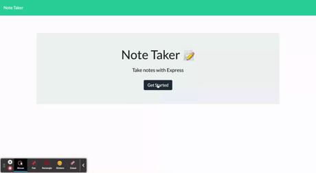

# Note Taker

## Description

Application allows user to take notes and notes are persisted to database. User has the ability to look at previous notes or delete notes if they want to.

## Table of Contents

- [Installation](#installation)
- [Demo](#demo)
- [Usage](#usage)
- [License](#license)
- [Contributing](#contributing)
- [Tests](#tests)
- [Questions](#questions)

## Installation

To install necessary dependencies, run the following command:

    (npm i)

## Demo

[Link to Demo video](https://watch.screencastify.com/v/edFpyxqcEhsCmc6ZHz4g)

## Usage

1. Open the website.

2. Click the Get Started button.

3. Enter your note's title and text into the appropriate fields in the right-hand portion of the screen.

4. Click the Save icon in the navigation bar in the top right of the screen.

5. Your note will be saved on the left hand side of the screen.

6. You have the ability to click the notes on the left side of screen to read them again or delete them if you wish

## License

The application is covered under the following license:

Info on License: [None](https://choosealicense.com/licenses/None)

## Contributing

If you wish to contribute please contact me by email.

## Test

To run tests, run the following command:

    (npm test)

## Questions

If you have any questions about the repo, open an issue or contact me directly at [adamjfield@gmail.com](mailto:adamjfield@gmail.com) Source Han Sans). You can find more of my work at [adamjfield](https://github.com/adamjfield).
